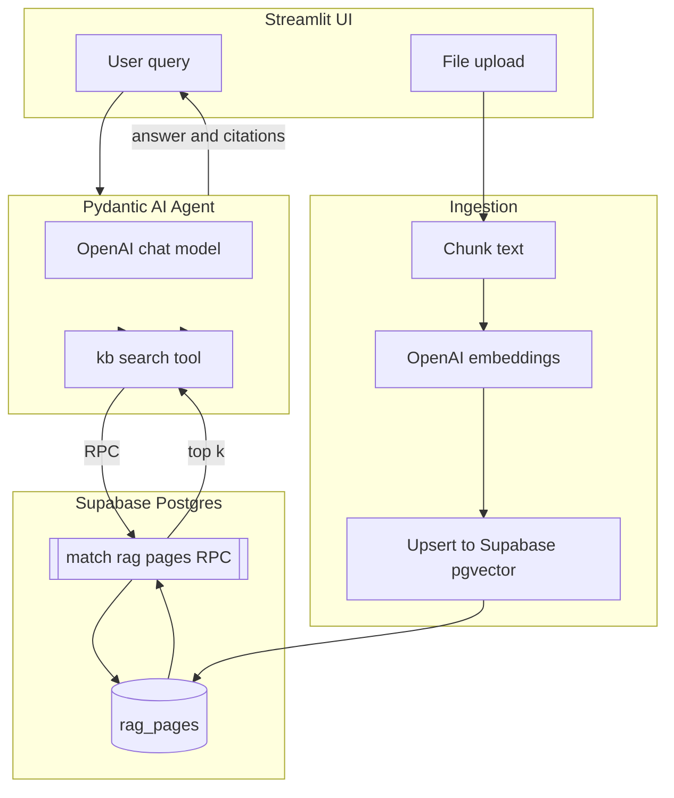

# RAG-Vs — Retrieval-Augmented Generation with Pydantic AI + Supabase + Streamlit

Build a clean, minimal, and practical RAG app:

- Pydantic AI powers the agent and streaming UX
- Supabase Postgres + pgvector stores and searches your chunks
- OpenAI generates embeddings and answers
- Streamlit provides dead-simple uploads + chat

## Highlights

- TXT/PDF ingestion with simple overlapping chunks
- Vector store on Supabase (pgvector + ivfflat index)
- kb_search tool that calls a Postgres RPC for fast similarity search
- Streaming responses in the UI with clear source attribution
- Tiny codebase with tests, ready to extend

## Architecture



## Quickstart

### Prerequisites

- Python 3.10+
- Supabase project (URL + Service Role key or anon key)
- OpenAI API key

### 1) Clone and configure

```powershell
# Clone
git clone https://github.com/Gabriel-0110/rag-vs-app-example.git
cd rag-vs-app-example

# Create virtualenv and install
python -m venv .venv
. .venv\Scripts\Activate.ps1
pip install -r requirements.txt

# Environment
cp .env.example .env   # or create manually
# Fill in: OPENAI_API_KEY, SUPABASE_URL, SUPABASE_SERVICE_ROLE_KEY (or anon key)
```

### 2) Prepare the database

Run the SQL in `rag-example.sql` in the Supabase SQL editor:

- Enables pgvector
- Creates `rag_pages` table + ivfflat index
- Defines `match_rag_pages` RPC
- Enables RLS with public read policy

### 3) Ingest some documents

```powershell
# Ingest any TXT/PDF files you have locally
python -m src.ingestion.ingest docs/links.md
# Multiple files supported
python -m src.ingestion.ingest path\to\file1.txt path\to\report.pdf
```

Flags you can tweak:

```powershell
python -m src.ingestion.ingest path\to\file.pdf --max-chars 1200 --overlap 150 --source my-upload
```

### 4) Start the UI

```powershell
streamlit run src/app_streamlit.py
```

- Upload TXT/PDF and click Ingest
- Ask questions; answers stream token-by-token
- Sources expander shows most-similar chunks (score included)

## Configuration

Provide these in `.env` (see `.env.example`):

- OPENAI_API_KEY: OpenAI key for embeddings + generation
- SUPABASE_URL: Supabase project URL
- SUPABASE_ANON_KEY or SUPABASE_SERVICE_ROLE_KEY: key for DB access
- Optional: MODEL (default: gpt-4o-mini), EMBED_MODEL (default: text-embedding-3-small)

## Components

- Ingestion: `src/ingestion/`
  - `pdf_text.py` (PyPDF2 extract)
  - `chunking.py` (character chunks with overlap)
  - `embeddings.py` (OpenAI embeddings)
  - `supabase_store.py` (upsert + similarity_search via RPC)
  - `ingest.py` (CLI wrapper)
- Agent: `src/agent/`
  - `kb.py` (@Tool kb_search that calls the RPC)
  - `agent.py` (OpenAI model + tools + system prompt)
  - `response_templates.py` (prompt text)
  - `compose_answer.py` (helper for citations)
- UI: `src/app_streamlit.py` (uploads + chat + sources)

## Programmatic usage

```python
from src.agent.agent import agent

res = agent.run_sync("Summarize uploaded docs and cite sources.")
print(res.output)
```

## Tests

```powershell
pytest -q
```

## Troubleshooting

- Missing OpenAI key: set OPENAI_API_KEY in .env
- RPC not found: run `rag-example.sql` in Supabase
- Embedding dimension mismatch: ensure pgvector column is `vector(1536)` and using `text-embedding-3-small`
- Slow similarity: ivfflat index needs ANALYZE; also keep `match_count` sane (e.g., 5–10)
- RLS blocked writes: upserts use your key; service role key is easiest for server-side ingestion

## Performance tips

- Chunk size ~800–1500 chars with 100–200 overlap is a good start
- Keep few-shot/system prompts lean to reduce token use
- Use metadata filters in `kb_search` when your corpus grows

## Security

- Never commit secrets. `.env` is gitignored
- Prefer service role key only in server-side flows; use anon key in clients

## Roadmap ideas

- Add citations inline to the streamed answer
- Eval harness for retrieval quality
- Batch ingestion directory watcher
- CI for lint/test + type checks

## Thanks

- Pydantic AI: https://ai.pydantic.dev/
- Supabase: https://supabase.com/
- Streamlit: https://streamlit.io/
